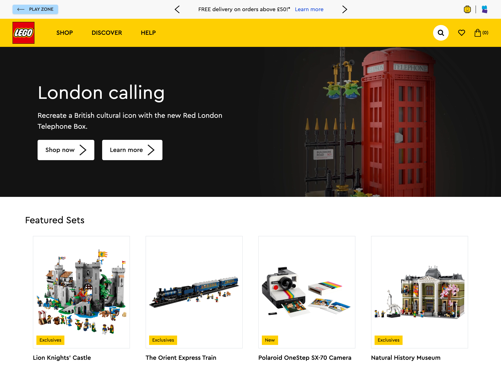

# Learn Components with React & LEGO®

## Introduction

This project takes you through the basic concepts of components and how to use them to build applications. You will also learn about React and use it to create a website loosley based on the LEGO® Shop.

Through this tutorial you will

- Add components to an existing template webpage
- Create new pages in a website
- Add navigation using a NavBar
- Develop custom components



## Setup

To help get started quickly, we recommend using [StackBlitz](https://stackblitz.com), an online code editor that allows you to start developing right away. You can find the project [here](https://stackblitz.com/github/fraserbenjamin/lego-shop). It provides a solid text editor without having to install anything on your computer. Just click the link and you can start building right away!

[](https://stackblitz.com/github/fraserbenjamin/lego-shop)

If you would like to run the project on your computer, you can clone the project from GitHub and run it locally. To do this, you will need to have Node.js installed on your computer. You can find the project [here](https://nodejs.org/en/). Once you have Node.js installed, you can clone the project from GitHub and run the following commands in the terminal `npm install` and `npm run dev`.

## What are Components?

Components are the building blocks of a React application. They are reusable pieces of code that can be used to build a user interface. Components can be thought of as custom HTML elements that can be used to build a website. They can be used to create complex user interfaces by combining multiple components together.

## Why use Components?

Components are a great way to build a website. They allow you to break down a website into smaller pieces, making it easier to manage and maintain. They also allow you to reuse code, which can save time and reduce the amount of code you need to write. Components are also a great way to build complex user interfaces, as they allow you to break down a website into smaller pieces, making it easier to manage and maintain.

## What's in the box?

Inside the `src` folder, you will find the following items:

- `assets`: This folder contains the images, videos & data files used in the project.

- `components`: This folder contains the individual components used to build the website. This could be everything from a button to a navigation bar.

- `pages`: This folder contains the pages of the website. Each page is made up of multiple components.

- `App.tsx`: This is the main file that contains the structure of the website. It is made up of multiple pages and components. Once you've created a new page or component, you will need to add it to this file to make it appear on the website.

- `main.tsx`: This is the file that renders the website. It is the first file that is run when the website is loaded.

- `index.css`: This file contains the basic styles for the website. We've used it to load in the LEGO® font.

- `types.ts`: This file contains the types used in the project. This is used to define the structure of the data used in the project. See the [TypeScript documentation](https://www.typescriptlang.org/docs/handbook/2/everyday-types.html) for more information.

## Getting Started

In the [Components](docs/Components.md) page, you can see a list of prebuilt items you can use to quickly build your site as well as how to add them. You can start by adding them in the provided `src/pages/Home.tsx` file.

Some components are used across all pages like the `NavBar` and `Footer` consider adding them in the `src/App.tsx` file which allows them to be re-used. You may need a different import URL though if you do this.

In paths note the following:

- `.` Current directory
- `..` Parent directory
- `../..` Up 2 directories
- `src/File.tsx` Path to a file from the position of the file its included in. For example this will point to a different location if its in the top-level folder rather than the `src/pages` folder.

### Starting the Homepage

- Start by opening the `src/pages/Home.tsx` file, this includes a basic placeholder component. Remove the `<Placeholder />` first, which will give you a blank page to get going in your preview screen.

- Add an import for a component, this goes at the top of the file and allows you to use the component later on in the file. For this example we're going to use the `TelephoneBoxHero`. At the top of the `Home.tsx` file `import TelephoneBoxHero from "../components/TelephoneBoxHero";`

- In the tags (`<>`) of the same file, include the component e.g. `<TelephoneBoxHero />`

- Save the file and your output should now show the element and your code should look like below.

```
import TelephoneBoxHero from "../components/TelephoneBoxHero";

const Home = () => {
  return (
    <>
      <TelephoneBoxHero />
    </>
  );
};

export default Home;
```

### Expanding the Homepage

Open the link below to see a full list of all the components you can add. Like you've done previously, copy/paste the component tags and imports like you've done in the previous step to start building out your own website. Once you've fleshed out the page similar to [lego.com](lego.com), move onto the next step.

[Components List](docs/Components.md)

### Adding Pages

You can add any page you'd like, however for this example we're going to create a contact page.

- To add a page create a new file in the `src/pages` folder e.g. `Contact.tsx`. The `.tsx` file extension is important here.

- Add the basic component structure, as well as any additional components inside of it, like you've done previously.

#### src/pages/Contact.tsx

```
import HelpBanner from "../components/HelpBanner";

const Contact = () => {
  return (
    <>
      <HelpBanner />
    </>
  );
};

export default Contact;
```

- Then inside `src/App.tsx` add the import to your new file at the top of the file e.g.
  `import Contact from './pages/Contact';`

- Finally, inside the `<Routes>` component create the component itself and a URL mapping using this example.
  `<Route path="/contact" element={<Contact />} />`

- You can change the URL by adjusting the `path` property and the page that will be rendered by alterting the `element` one.

### Navigation

When adding new screens, you may want to use the `NavBar` to be able to open them. Once the route has been added in `src/App.tsx` you're ready to go and can access the page by adding the `path` you've chosen into the URL bar.

To add the route in the NavBar, open the `src/components/NavBar.tsx` file and edit the `<Link>` components to match. The `to` property is the URL you'd like to navigate to and the text inbetween the two tags is the part that will be displayed.

### Creating Custom Components

You can create custom components from scratch if you're feeling confident or edit an existing one to get started. Try creating a new Hero element by copying and pasting the `src/components/IconsBirdHero.tsx` into the same folder, renaming it to something else. You can then edit this file, changing the text and images to match what you'd like. You could replace `src={iconsBirdHeroJPG}` with an image from the web by using a string e.g. `src="https://lego.com/example/image.png"`

As you get more confident, you'll be able to customise and build more complex components. In this demo we've add some basic interactivity, have a look at `PromoBar.tsx` which adds buttons to be able to click through content.

## Tools

To help you get going quickly we've added some other tools to the project, you don't need to worry about these too much at the moment, but they are there to help you as you progress through the project. You're welcome to explore them if you're interested.

- `react`: This is a JavaScript library that allows you to build user interfaces. It is a popular tool that is used to build component based websites. Learn more about React [here](https://reactjs.org/).

- `react-router-dom`: This is a tool that allows you to create a multi-page website. It allows you to create links between pages and manage the state of the website. Learn more about React Router [here](https://reactrouter.com/).

- `tailwindcss`: This is a tool that allows you to create custom styles for your website. It is a utility-first framework that allows you to quickly style your website without having to write a lot of CSS. Learn more about Tailwind CSS [here](https://tailwindcss.com/).

- `typescript`: This is a superset of JavaScript that allows you to add types to your code, making it easier to manage and maintain. See the [TypeScript documentation](https://www.typescriptlang.org/docs/handbook/2/everyday-types.html) for more information.

- `vite`: This is a tool that allows you to quickly build and run your website. It is a development server that allows you to quickly see the changes you make without having to refresh the page. Learn more about Vite [here](https://vitejs.dev/).
