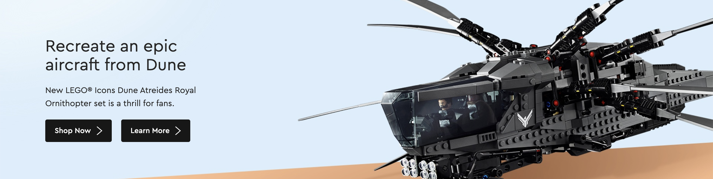

# Components

This page contains a list of all the components you may want to use when building your site.

# Usage

To add a component, add the import at the top with its path e.g. `import PromoBar from "../components/PromoBar";` at the top of the file.

Then inside the `return` function include the component e.g. `<PromoBar />`. Make sure to include the `/` at the end. Some components like the `ProductCard` require additional properties. See the examples below for how to add them.

# Gallery

## Call To Action

`<CallToAction />`


## Data Safety

`<DataSafety />`


## Dune Hero

`<DuneHero />`



## Eiffel Tower Hero

`<EiffelTowerHero />`


## Featured Sets

`<FeaturedSets />`


## Footer

`<Footer />`


## Gift With Purchase

`<GiftWithPurchase />`


## Help Banner

`<HelpBanner />`


## Icons Bird Hero

`<IconsBirdHero />`


## Nav Bar

`<NavBar />`


## Product Card

The product card has a number of required properties, including the name, price and an image. You can also provide optional properties such as a tag and rating. Note the diffent use of `{}` and `""`. As `price` and `rating` are numbers you should use parentheses/braces. For text you can just use quotes. Some fields only accept certain types, for example `tag` can only be `new` or `exclusive`.

```
<ProductCard
  name="Lion Knights' Castle"
  price={344.99}
  rating={5}
  image="https://www.lego.com/cdn/cs/set/assets/blt0254ea3dce736ea0/10305.png"
  tag="exclusive"
/>
```


## Promo Bar

`<PromoBar />`


## Read All About It

`<ReadAllAboutIt />`


## Star Wars Hero

`<StarWarsHero />`


## Support Topics

`<SupportTopics />`


## Telephone Box Hero

`<TelephoneBoxHero />`


## Top Picks

`<TopPicks />`


## Welcome Message

`<WelcomeMessage />`


